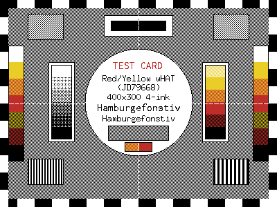
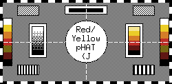

# epaper

[](https://github.com/sweeney/epaper/actions/workflows/ci.yml)
[](https://pkg.go.dev/github.com/sweeney/epaper)
[](https://goreportcard.com/report/github.com/sweeney/epaper)

A Go library for driving e-ink panels from a Raspberry Pi.

Make the panel disappear, so that a program that wants to put something on an
e-ink screen thinks only about the picture.

> **Status: v0.** Working end to end on two panels: an Inky wHAT 4.2" on a
> Pi 4B (20.5 s a refresh) and an Inky pHAT 2.13" on a Pi Zero 2 W (18.5 s).
> The API may still change before v1.0. See [`PLAN.md`](PLAN.md) for the design
> and the milestone list, [`PLAN.md` §13](PLAN.md) for what the second
> controller cost, and [`CONTRIBUTING.md`](CONTRIBUTING.md) for how to add one.

<table>
<tr>
<td align="center" valign="bottom">

</td>
<td align="center" valign="bottom">

</td>
</tr>
<tr>
<td align="center"><b>Inky wHAT 4.2"</b> — 400 × 300</td>
<td align="center"><b>Inky pHAT 2.13"</b> — 250 × 122</td>
</tr>
</table>

One card, one code path, laid out from whichever panel it is given. Four inks
and nothing in between: every grey, orange and pink above is ordered dither or
a 1px checkerboard, which this hardware resolves cleanly.

Those are not marketing renders. They are the committed goldens the tests
assert against, so they cannot drift from what the library actually draws — and
they are shown at 1:1 on purpose, because a panel render at 2× flatters exactly
the defects that ruin small text on a display with no intermediate tones.

## What it looks like

```go
package main

import (
	"context"
	"image"
	"log"
	"time"

	"github.com/sweeney/epaper"
	"github.com/sweeney/epaper/inky"
	"github.com/sweeney/epaper/render"
	"github.com/sweeney/epaper/testcard"
)

func main() {
	dev, err := inky.Open()
	if err != nil {
		log.Fatal(err)
	}
	defer dev.Close()

	// Bounds and palette both come from the device, so the image cannot
	// disagree with the panel it is going to.
	c := render.NewCanvasFor(dev)
	c.Fill(epaper.White)

	header := image.Rect(0, 0, 400, 48)
	c.Rect(header, epaper.Red)
	c.TextFitted(header.Inset(6), "HELLO", testcard.Fonts(), epaper.White)

	// One check for all the drawing above: the first failure is recorded and
	// later calls become no-ops, so nothing is hidden.
	if err := c.Err(); err != nil {
		log.Fatal(err) // e.g. this panel has no red
	}

	ctx, cancel := context.WithTimeout(context.Background(), time.Minute)
	defer cancel()

	if err := dev.Show(ctx, c.Image()); err != nil {
		log.Fatal(err)
	}
}
```

Nothing in that mentions SPI, GPIO, chip-select, bit packing or refresh
sequencing. That is the bar.

## Design rules

These come from things that actually bit us on the bench, not from taste.

| Rule | Why |
|---|---|
| Never `os.Exit`, never panic on hardware state | A library that kills its caller cannot be used in a service |
| Every failure is a returned `error` | Sentinel errors, so callers can `errors.Is` and act |
| No cgo | `GOOS=linux GOARCH=arm64 go build` gives a static binary, cross-compiled from a Mac |
| No root required | A user in `spi`, `i2c` and `gpio` can drive the panel |
| `context.Context` on anything that blocks | A refresh takes ~20 s |
| Measure, don't inherit | Copied constants are cited; copied *delays* are tested for load-bearingness first — one turned out to be a debugging leftover costing 19% of every refresh |

## Supported hardware

| Board | Controller | Resolution | Refresh | Inks |
|---|---|---|---|---|
| Inky wHAT 4.2" (Pimoroni) | JD79668 | 400 × 300 | ~20.5 s | Black, white, yellow, red |
| Inky pHAT 2.13" (Pimoroni) | JD79661 | 250 × 122 | ~18.5 s | Black, white, yellow, red |

All four inks display **simultaneously** — "red/yellow" in the EEPROM means
both at once, not a choice between them. Refresh is full-panel only, and both
figures are measured on the hardware rather than quoted from a datasheet.

Ask the library rather than this table, which will go stale:

```bash
go run ./cmd/epaper-testcard -list
```

```
GEOMETRY    MODEL                           CONTROLLER  EEPROM VARIANT
250x122     Red/Yellow pHAT (JD79661)       JD79661     23
400x300     Red/Yellow wHAT (JD79668)       JD79668     24
```

The panel identifies itself over I2C, so `inky.Open()` needs no configuration
and refuses a board it has no driver for rather than guessing.

The split is **by controller**, with a thin board package on top, because that
is the shape the hardware already has — controllers are made by Solomon Systech
and Fitipower, then rebadged by every board vendor. Adding a new controller
means a new `driver/` package and one case in `inky.OpenWith`. See
`CONTRIBUTING.md`.

> The two four-ink Inky boards are a good illustration of why the split is
> there. They report the same colour string, the same PCB revision and use the
> same pin map; only the EEPROM's display-variant byte separates them. Behind
> the glass they are different chips with different init sequences and — the
> part that matters — different frame layouts. The JD79668 sends its buffer
> row-major; the JD79661 pads one axis and sends the result rotated a quarter
> turn. Picking the wrong one draws nothing, with no error. `PLAN.md` §13 has
> the derivation.

### Pi setup

Tested on a Pi 4B and a Pi Zero 2 W. In `/boot/firmware/config.txt`:

```
dtparam=i2c_arm=on
dtparam=spi=on
dtoverlay=spi0-0cs
```

`dtoverlay=spi0-0cs` is **required**. Without it the kernel SPI driver owns
GPIO 8 and the panel cannot be addressed; the failure presents as a chip-select
conflict, not as a missing device. `inky.Open` says so in the error.

You also need the `i2c-dev` module, which `dtparam=i2c_arm=on` does **not**
pull in — without it there is no `/dev/i2c-1` and a perfectly seated HAT reads
as absent:

```bash
echo i2c-dev | sudo tee /etc/modules-load.d/epaper-i2c.conf
sudo modprobe i2c-dev
```

The user must be in the `spi`, `i2c` and `gpio` groups. Root is not needed.

## Orientation: the panel decides, and it is landscape

`Bounds()` reports the panel's native geometry — 250 × 122 or 400 × 300, always
landscape — and `Show` rejects an image of any other shape with `ErrWrongSize`
before it touches the hardware. **There is no rotation in this library.**

That is a decision, not an oversight ([`PLAN.md`](PLAN.md) §9.9): rotation could
reasonably live on the device, on the canvas, or as a render helper, and
committing to one before v1.0 without a settled use case is guesswork.

To mount a panel portrait today, draw into a transposed canvas and rotate the
result into the panel's frame. That is the entire recipe:

```go
b := dev.Bounds()                                    // 250x122, landscape
c := render.NewCanvas(image.Rect(0, 0, b.Dy(), b.Dx()), dev.Palette())  // 122x250
// ...draw normally...
if err := dev.Show(ctx, rotateCW(c.Image(), dev.Palette())); err != nil {
	log.Fatal(err)
}
```

[`examples/portrait`](examples/portrait) has `rotateCW` and a runnable version.
Take it from there rather than rederiving it — every quarter turn looks
plausible, only one is right, and on a panel each guess costs 18 seconds.

Two things that are easy to state backwards:

- **The content rotates clockwise, so the panel turns anticlockwise.** Those
  are opposites and it is very easy to say one while meaning the other.
- **Rotating costs nothing.** 30,000 pixel copies against an 18.5 s refresh.
  If you are tempted to push it into the driver for speed: the JD79661's
  controller frame is natively *portrait* 128 × 250, and the driver already
  rotates it to present landscape — so asking for portrait rotates twice and
  cancels out.

## Text: use a bitmap font

The one genuinely surprising thing about this hardware, learned the hard way
and worth knowing before you draw any text:

**Below about 16px, a scaled outline font cannot render legibly on a panel with
no intermediate tones, and no amount of tuning fixes it.** A stem is about one
pixel wide and lands at an arbitrary sub-pixel position, so after thresholding
some stems come out one pixel and their neighbours two. It reads as bad
letter-spacing rather than as missing ink, which is why it is easy to
misdiagnose.

`testcard.Fonts()` returns bitmap faces and needs no font file. See
[`render.FontFamily`](https://pkg.go.dev/github.com/sweeney/epaper/render#FontFamily)
for the details, including why `font.HintingFull` does not help.

### Sizes come in steps — design to them

The consequence lands on **layout**, not on text quality, so it belongs here
rather than buried in a doc comment. `testcard.Fonts()` can produce exactly
five sizes:

```
13   17   34   51   68        testcard.FontSizes()
```

Everything between rounds **down**: asking for 48 gets you 34, and so does
asking for 50. There is no 40.

That matters most for headlines, because the 34→51 gap is 17px wide and lands
where a headline wants to be. On a 400px panel:

| | at 34px | at 51px |
|---|---|---|
| `WAIT IF YOU CAN` | 240px | 360px |
| `13:08` | 80px | 120px |
| both, side by side | **320px — fits** | **480px — cannot fit** |

So a headline with anything beside it has one usable size on that panel, not
two. Decide which step you are designing to before you lay the screen out, and
ask rather than guess:

```go
size := testcard.LargestFontSizeFor(boxHeight)   // 0 if nothing fits
```

**Half steps are not on the table.** A 1.5× face would put glyph edges between
pixels, which is the entire reason these are integer-scaled bitmaps — see
`render.FontFamily`. The escape hatch is `testcard.FontsWith`, which takes your
own TrueType face above ~17px; note that it leaves the small sizes as bitmaps,
so you get a mixed aesthetic unless you commit to it deliberately.

### Text that does not fit: three answers

Pick by what you want to give: the size, the line count, or the words.

| | Behaviour | Use when |
|---|---|---|
| `Canvas.TextFitted` | shrinks the text until it fits | the box is fixed and the text must all show |
| `Canvas.TextWrapped` | runs onto more lines, clips, **records an error** | the width is fixed and there is vertical room |
| `Canvas.TextTruncated` | cuts at a fixed size and adds `...` | a dashboard: the size must not change between refreshes |

`TextTruncated` deliberately does **not** record an error, unlike the other
two. An ellipsis is visible on the glass, so the viewer can see something was
cut — which is the job the error does for text that silently vanishes.

## Try it

```bash
go run ./cmd/epaper-testcard -png card.png    # no hardware needed
go run ./cmd/epaper-testcard                  # draw on the panel, ~20 s
```

`-png` renders every supported resolution by default, because the card is laid
out *from* the panel's size and "it looks right" is a claim about one geometry
until you have looked at the others:

```bash
make testcard-png                          # one PNG per supported panel
make testcard-png SIZE=250x122             # just the pHAT
make testcard-png SIZE=pHAT PATTERN=orientation
make testcard HOST=user@pi PATTERN=orientation   # on the glass
```

`-size` takes a `WxH`, a model substring or a controller name. A geometry
nobody sells is allowed on purpose — seeing what the layout does at a size is
how you decide whether a panel is worth writing a driver for.

The **orientation** pattern is the one to draw on a panel whose driver rotates.
Four differently-inked corners and an arrow pointing at the top-left one, so
all eight ways of getting it wrong look different. A rotation sign error
produces a picture that is complete, correctly coloured and upside down, which
no byte-level test can see.

One line proves a panel, its wiring and the whole stack:

```go
dev, err := inky.Open()
if err != nil {
	log.Fatal(err)
}
defer dev.Close()

if err := testcard.Show(ctx, dev, "bench check"); err != nil {
	log.Fatal(err)
}
```

## Performance

Measured on the Pi 4B itself, not on a laptop:

| | |
|---|---|
| Draw the whole test card | **4.6 ms** |
| Draw the conformance pattern | **1.7 ms** |
| Pack a 400×300 frame to 30,000 bytes | **0.8 ms** |
| **Refresh the panel** | **20,500 ms** |

The pHAT on a Pi Zero 2 W refreshes in **18.5 s**, repeatable to 15 ms across
an eight-refresh soak — a slower host and a smaller panel, and the panel is
still the entire cost.

Drawing and packing together are about **0.03%** of a refresh. The panel is
roughly four thousand times slower than the software driving it, so render
cost is not worth optimising — and the one optimisation that was worth making
(accumulating each packed byte in a register rather than four
read-modify-writes) was found by a benchmark noticing that packing was
data-dependent when it had no business being.

Everything except `Pack` allocates nothing per call.

## Examples

[`examples/`](examples) has five, smallest first:

| | | Needs a panel? |
|---|---|---|
| [`hello`](examples/hello) | The smallest useful program | Yes |
| [`offline`](examples/offline) | Building a layout with no hardware | **No** |
| [`portrait`](examples/portrait) | Mounting a landscape panel on its end | Optional |
| [`dashboard`](examples/dashboard) | A realistic status panel | Optional |
| [`consumertest`](examples/consumertest) | Testing *your own* display code | **No** |

Start with `offline`. The fastest way to build for e-ink is to not use the
panel: a refresh takes 20 seconds, a PNG takes 20 milliseconds and you can
diff it. Then swap `mock.New` for `inky.Open` — that one line is the only
difference.

## Testing without a Pi

Most of this library is pure and runs on a laptop:

```bash
make test     # pure packages, fast
make build    # cross-compile for the Pi
make check    # everything CI runs
```

`testdata/` holds fixtures captured from real hardware — a conformance pattern
and a JD79661 frame layout, both byte-exact against the vendor library, and
eight EEPROM records covering both real boards plus six failure modes. See
[`testdata/README.md`](testdata/README.md); those fixtures are oracles, so if
your code disagrees with one, your code is wrong.

The `mock` package implements `epaper.Device` in memory, so a consumer can build
and test an entire display program with no hardware present.

Every CI run attaches a self-contained HTML report — results, per-package
coverage, and the rendered goldens, with expected and actual shown side by
side when one changes. Build it locally with `make report`.

Hardware tests are behind `//go:build hardware` and never run in CI:

```bash
make test-hw HOST=user@your-pi
```

### How far the fixtures go

The conformance pattern is reproduced **byte for byte** by the `render`
package: all 120,000 palette indices, and the 30,000 packed bytes the vendor
library would have sent. Every shape in it follows a rule written down in
`testdata/README.md` rather than inherited from another library's rasteriser,
which is what makes that comparison possible at all.

## Troubleshooting

Every one of these is something that actually happened on the bench, and the
error message the library gives you is listed so it can be searched for.

**`GPIO 8 (chip select) is already claimed`**
The kernel SPI driver owns the pin. Add `dtoverlay=spi0-0cs` to
`/boot/firmware/config.txt` and reboot. With the overlay set, `/dev/spidev0.1`
disappears and chip-select becomes ours to drive. This presents as a busy line
rather than as a missing device, which is why the error spells out the fix.

**`claiming GPIO lines (is the user in the gpio group?)`**, or the same for
`spi` / `i2c`
Add yourself: `sudo usermod -aG spi,i2c,gpio $USER`, then log out and back in.
Root is never required.

**`reading the identification EEPROM ... (is a HAT attached?)`**
Usually nothing is plugged in, or I2C is off (`dtparam=i2c_arm=on`). Note that
**`i2cdump -b` lies about this part**: it uses byte-mode SMBus reads, and this
EEPROM needs a two-byte register address written first. The convincing garbage
it returns cost us a day chasing a seating fault on good hardware. Use
`inky.Identify` instead, which does the combined transaction.

**`the panel reported the refresh complete after only 12ms, but a full refresh
takes about 20s ... nothing was drawn`**
The BUSY line is not connected. It has a host pull-up, so a disconnected BUSY
reads *ready* and every wait returns instantly — an idle panel and a
disconnected one are indistinguishable by reading the line, which is why the
driver times the refresh instead. Check the wiring on GPIO 17.

**`panel still busy after 40s`**
The refresh genuinely stalled. Power-cycle the panel. If it recurs, try
`inky.Options{CommandDelay: jd79668.VendorCommandDelay}` — that restores the
reference implementation's timing, which this library drops for the reasons in
`PLAN.md` §9.3, and please open an issue saying what happened.

**`ink green is not on this panel`**
The panel has four inks and green is not one of them. Nothing is substituted,
deliberately: a panel that looks plausible and is wrong is the worst outcome on
a display nobody is watching. Use `dev.Palette().NearestTo(epaper.Green)` if a
rough match is genuinely what you want.

**`text does not fit`**
Exactly what it says, and worth trusting. On e-ink there is no scrollbar and no
overflow indicator, so text that does not fit simply is not there. Use
`TextFitted` to shrink, `TextWrapped` to run on, or make the box bigger.

**Text looks badly spaced or broken up**
Use a bitmap font — see [above](#text-use-a-bitmap-font). This one took two
wrong "fixed" claims to diagnose.

**`image palette is not the panel's`**
Build images with `dev.NewImage()` or `render.NewCanvasFor(dev)`. The palette's
order *is* the wire format, so a same-length palette with two inks swapped
means every index denotes a different colour.

## Licence

MIT — see [`LICENSE`](LICENSE).

The JD79668 and JD79661 command sequences, their payload constants, the frame
layouts, the EEPROM layout and the display-variant table are derived from
Pimoroni's [`inky`][inky] library, which
is also MIT licensed. That derivation is acknowledged in [`NOTICE`](NOTICE), the
vendor source is reproduced under `reference/vendor-inky/` so any constant can
be checked against its origin, and each derived block in our source names the
file it came from.

[inky]: https://github.com/pimoroni/inky
